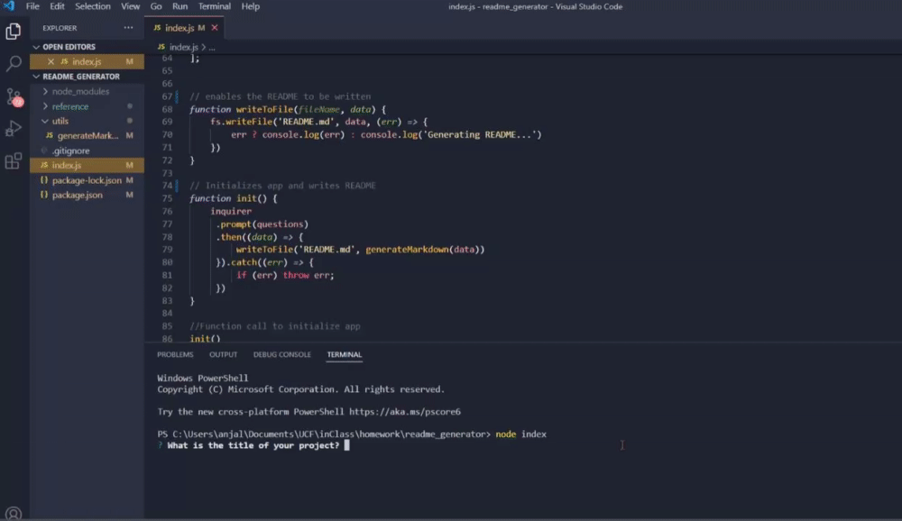

# README.md Generator
      
 ## Table of Contents 

      
-----------------------------------------

      
 - [Description](#description) 

      
 - [Showcase](#link) 

      
 - [Installation Instructions](#install)

      
 - [Usage Information](#usage) 

      
 - [Licenses](#license) 

      
 - [Contributors](#contributors) 

      
 - [Questions?](#email) 

      
 ## Description 

      
-----------------------------------------

      
 Are you tired of organizing your own README entirely by hand? This app was created to make that whole process just a little bit easier for you. This is a command-line application that will generate a README file with your own inputs such as an installation guide, contributors and licenses used in your project.

      
 ## Showcase

      
-----------------------------------------
 
      
 

Video Tutorial: https://drive.google.com/file/d/1Zcn6E8hLhepo1JRqsELEaAn2mQEVYHZS/view?usp=sharing
      
 ## Installation Instructions

      
-----------------------------------------
 
      
 After cloning down the repo to your own local, make sure to run `npm install` in order to install the required dependencies and then run the application by running `node index.js` and answer the questions based off of your project.

      
 ## Usage Information 

      
-----------------------------------------
 
      
  The dependencies used in this application are `Inquirer` and `fs`

      
 

      
 ## License 

      
-----------------------------------------
 
      
  

      
 ## Contributors

      
-----------------------------------------
 
      
  

      
 ## Questions?

      
-----------------------------------------
 
      
  My Github: [Akuruu](https://github.com/Akuruu)

      
 Contact Me: anjalismith0529@gmail.com 
